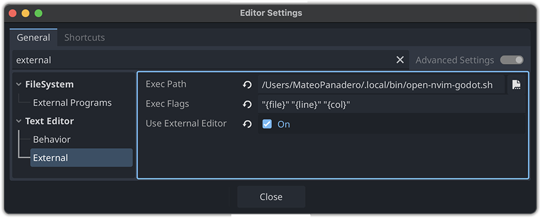

<div align="center"></div>

# godot-lsp.nvim

A Neovim plugin to integrate Godot's LSP for GDScript, providing features like _go-to-definition, hover documentation, diagnostics,_ and _completion_ across multiple buffers. Supports TreeSitter syntax highlighting and experimental DAP debugging.

## 📑 Table of Contents

- [✨ Features](#-features)
- [❗ Requirements](#-requirements)
- [🌱 Why I Created This Plugin](#-why-i-created-this-plugin)
- [🚀 Quick Start](#-quick-start)
- [⚙️ Setup](#%EF%B8%8F-setup)
  - [📦 Installation](#-installation)
  - [🌳 TreeSitter Parser](#-treesitter-parser)
  - [🌐 External Editor](#-external-editor)
- [🎮 Usage](#-usage)
  - [🤖 Commands](#-commands)
  - [🛠️ Configuration](#%EF%B8%8F-configuration)
  - [📋 Debug Logging](#-debug-logging)
  - [🪲 DAP Debugging](#-dap-debugging)
- [🕵🏻‍♂️ Troubleshooting](#%EF%B8%8F-troubleshooting)
- [🤝 Contributing](#-contributing)
- [📄 License](#-license)

## ✨ Features

- **LSP Integration**: Autocompletion, definitions, references, and diagnostics via Godot’s LSP.
- **Multi-Buffer Support**: Syncs LSP across all GDScript buffers.
- **TreeSitter**: Enhanced syntax highlighting.
- **Custom Keymaps**: Configurable shortcuts for LSP actions.
- **DAP Debugging**: Experimental debugging support (unstable).

<details>
<summary>Full Feature Details</summary>

- Connects to Godot’s LSP server via `ncat` on port 6005.
- Supports go-to-definition, hover documentation, renaming, and workspace symbols.
- Automatic buffer attachment and TreeSitter highlighting on `.gd` file open.
- Experimental DAP with breakpoints and step-through (requires `nvim-dap`).

</details>

## ❗ Requirements

- Neovim 0.9.0+
- `ncat` (e.g., `brew install ncat` on macOS, `apt install ncat` on Linux)
- Godot 4.3+ with `--lsp`
- [nvim-lspconfig](https://github.com/neovim/nvim-lspconfig)
- [nvim-treesitter](https://github.com/nvim-treesitter/nvim-treesitter)
- Optional: [telescope.nvim](https://github.com/nvim-telescope/telescope.nvim), [nvim-dap](https://github.com/mfussenegger/nvim-dap), [nvim-dap-ui](https://github.com/rcarriga/nvim-dap-ui)

## 🌱 Why I Created This Plugin

I built this to use Neovim as my Godot external editor, frustrated by ineffective setups and plugins. It’s macOS-focused, uses Ghostty, but runs on Linux too. No Windows support yet—contributions welcome! Ooh did I mentioned experimental DAP debugging?

## 🚀 Quick Start

1. Install with **lazy.nvim**:
   ```lua
   require("lazy").setup({ { "Mathijs-Bakker/godot-lsp.nvim" } })
   ```
   ```
   :Lazy sync
   ```
1. Start Godot: `godot --editor --lsp --verbose`
1. Configure external editor (see Setup).
1. Open a `.gd` file in Neovim for LSP features.

## ⚙️ Setup
### 📦 Installation
Use lazy.nvim:
```
luarequire("lazy").setup({
  { "Mathijs-Bakker/godot-lsp.nvim", config = function() require("godot-lsp").setup() end },
  { "neovim/nvim-lspconfig" },
  { "nvim-treesitter/nvim-treesitter", build = ":TSUpdate" },
})
```
Then run:
```
:Lazy sync
```

### 🌳 TreeSitter Parser
Install the `gdscript` parser:
```
:TSInstall gdscript
```

### 🌐 External Editor

1. Create a launch script (e.g., `~/.local/bin/open-nvim-godot.sh`):
    ```bash
    #!/bin/bash
    FILE="$1" LINE="$2" COL="$3"
    /Applications/Ghostty.app/Contents/MacOS/ghostty -- nvim "$FILE" +"$LINE:$COL"
    # Linux: gnome-terminal -- nvim "$FILE" +"$LINE:$COL"
    ```
1. Make executable: 
    ```bash
    chmod +x ~/.local/bin/open-nvim-godot.sh
    ```
1. Add to PATH: 
    ```bash
    echo 'export PATH="$HOME/.local/bin:$PATH"' >> ~/.bashrc && source ~/.bashrc
    ```
1. Configure Godot: `Editor > Editor Settings > Text Editor > External` with full path and `"{file}" "{line}" "{col}"`.
<div align="center"></div>

### 🎮 Usage

- Start Godot with `godot --editor --lsp --verbose`.
- Open `.gd` files for LSP and TreeSitter features.
- Use keymaps (see Configuration).

<details>
<summary>Advanced Usage</summary>

- **Keymaps**: `gd` (definition), `K` (hover), `<leader>cd` (diagnostics), etc.
- **Autocommands**: Auto-attaches buffers, syncs with Godot.
- See [Commands](#-commands) and [Configuration](%EF%B8%8F-configuration) for more.
</details>

### 🤖 Commands

- `:GodotLspStart:` Start LSP manually.
- `:GodotLspStatus:` Check server status.
- `:GodotLspAttachAll:` Attach all buffers.

### 🛠️ Configuration
Customize via `setup`:
```lua
require("godot-lsp").setup({
  cmd = { "ncat", "localhost", "6005" },
  keymaps = { definition = "gd", hover = "K", format = nil },
})
```
You can find a complete setup example [here](docs/TROUBLESHOOTING.md#%EF%B8%8F-example-setup).

## 📋 Debug Logging
Enable with `debug_logging = true` for logs in `~/.cache/nvim/godot-lsp.log`.

## 🪲 DAP Debugging
Enable with `dap = true` and `godot --remote-debug localhost:6006 --editor`.  
Use: 
- `<F5>` (continue),
- `<F9>` (breakpoint), 
- etc.

# 🕵🏻‍♂️ Troubleshooting

Common Issues: LSP not starting, no syntax highlighting, DAP failures, plugin setup.  
Details: See full [troubleshooting](docs/TROUBLESHOOTING.md) for steps and workarounds.

## 🤝 Contributing
Submit issues or PRs at github.com/Mathijs-Bakker/godot-lsp.nvim.

## 📄 License
[MIT License](LICENSE)

