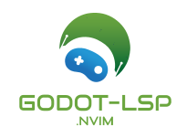

<div align="center"></div>

# godot-lsp.nvim

A Neovim plugin to integrate Godot's Language Server Protocol (LSP) for GDScript, providing features like go-to-definition, hover documentation, code actions, diagnostics, and completion across multiple buffers. Supports TreeSitter syntax highlighting and experimental DAP debugging.

## 📑 Table of Contents

- [Features](#✨-features)
- [Requirements](#🛠️-requirements)
- [:seedling: Why I Created This Plugin](#-why-i-created-this-plugin)
- [Installation](#-installation)
  - [With lazy.nvim](#-with-lazynvim)
  - [Install TreeSitter Parser](#install-treesitter-parser)
- [External Editor Setup](#-external-editor-setup)
- [Usage](#-usage)
  - [Commands](#commands)
  - [Configuration](#configuration)
  - [Debug Logging](#debug-logging)
  - [DAP Debugging (Experimental)](#dap-debugging-experimental)
- [Troubleshooting](#-troubleshooting)
- [Example Setup](#-example-setup)
- [Contributing](#-contributing)
- [License](#-license)

## ✨ Features

- **LSP Integration**: Connects to Godot's LSP server via `ncat` for GDScript autocompletion, definitions, declarations, type definitions, references, renaming, code actions, diagnostics, and formatting.
- **Multi-Buffer Support**: Seamlessly attaches multiple GDScript buffers to the same LSP client, enabling consistent LSP features across all open files.
- **TreeSitter Support**: Enables syntax highlighting for GDScript files using `nvim-treesitter`.
- **Automatic Buffer Attachment**: Attaches all GDScript buffers to the LSP client automatically on file open or buffer creation.
- **Customizable Keymaps**: Configurable key bindings for LSP actions like go-to-definition, hover, diagnostics navigation, renaming, and formatting.
- **User Commands**: Commands to start the LSP, check server status, and attach buffers manually.
- **Autocommands**: Automatically starts LSP, attaches buffers, ensures highlighting, and syncs script changes with Godot.
- **DAP Debugging (Experimental)**: Optional support for debugging GDScript with breakpoints, step-through, and variable inspection using `nvim-dap`.

## 🛠️ Requirements

- Neovim 0.9.0 or later
- `ncat` (Netcat) installed (`brew install ncat` on macOS, `apt install ncat` on Debian/Ubuntu)
- Godot 4.3 or later with LSP enabled (`godot --editor --lsp --verbose`)
- [nvim-lspconfig](https://github.com/neovim/nvim-lspconfig)
- [nvim-treesitter](https://github.com/nvim-treesitter/nvim-treesitter) for syntax highlighting
- Optional: [telescope.nvim](https://github.com/nvim-telescope/telescope.nvim) for enhanced references and workspace symbols
- Optional (for DAP): [nvim-dap](https://github.com/mfussenegger/nvim-dap) and [nvim-dap-ui](https://github.com/rcarriga/nvim-dap-ui)

## :seedling: Why I Created This Plugin

I wanted to use Neovim as my external editor for Godot, enhancing my workflow with its powerful features. However, I had some bad setups that didn’t work, and other plugins didn’t do the trick for my specific needs. Frustrated with the lack of a reliable solution, I decided to make one myself. Debugging is still in progress and not probably stable yet, so expect some rough edges. I am on macOS and haven’t tested this on Linux, though it might work with some adjustments. I am using Ghostty as my daily driver, but other terminal emulators like Kitty should work too — feel free to try it. There’s no Windows support as I don’t have a Windows machine, and I’m not planning to support it, but contributions are welcome if someone wants to add it.

## 📦 Installation

Install using your preferred Neovim package manager.

### With [lazy.nvim](https://github.com/folke/lazy.nvim)

Add to your `init.lua`:

```lua
require("lazy").setup({
  {
    "Mathijs-Bakker/godot-lsp.nvim",
    config = function()
      require("godot-lsp").setup({
        cmd = { "ncat", "localhost", "6005" }, -- Default LSP connection
        filetypes = { "gdscript" },
        skip_godot_check = true, -- Skip Godot process check
        debug_logging = true,    -- Enable debug logs in ~/.cache/nvim/godot-lsp.log
        dap = true,              -- Enable experimental DAP support
        keymaps = {              -- Customize LSP and DAP keymaps
          definition = "gd",
          declaration = "gD",
          type_definition = "gt",
          hover = "K",
          code_action = "<leader>ca",
          completion = "<C-x><C-o>",
          diagnostic_open_float = "<leader>cd",
          diagnostic_goto_next = "]d",
          diagnostic_goto_prev = "[d",
          references = "<leader>cr",
          rename = "<leader>rn",
          workspace_symbols = "<leader>ws",
          format = "<leader>f",
          dap_continue = "<F5>",
          dap_toggle_breakpoint = "<F9>",
          dap_step_over = "<F10>",
          dap_step_into = "<F11>",
          dap_step_out = "<F12>",
          dap_ui = "<leader>du",
        },
      })
    end,
  },
  { "neovim/nvim-lspconfig" },
  {
    "nvim-treesitter/nvim-treesitter",
    build = ":TSUpdate",
    config = function()
      require("nvim-treesitter.configs").setup({
        ensure_installed = { "gdscript" },
        highlight = { enable = true, additional_vim_regex_highlighting = false },
      })
    end,
  },
  { "mfussenegger/nvim-dap", optional = true }, -- For DAP
  { "rcarriga/nvim-dap-ui", optional = true }, -- For DAP UI
})
```
Run `:Lazy sync` to install.

### Install TreeSitter Parser

Ensure the `gdscript` parser is installed:

```lua
:TSInstall gdscript
```

## ⚙️ External Editor Setup
To open GDScript files from Godot directly in Neovim (running in a terminal) at the exact line and column, use a launch script for consistent behavior and to handle file paths with spaces. Use the full path to the script to avoid issues with ~ expansion.

1. **Create a Launch Script:**

    - Save the following as `/Users/<your-username>/.local/bin/open-nvim-godot.sh` (ensure `/Users/<your-username>/.local/bin` is in your `PATH`):
      ```bash
      #!/bin/bash
      # /Users/<your-username>/.local/bin/open-nvim-godot.sh
      FILE="$1"
      LINE="$2"
      COL="$3"
      /Applications/Ghostty.app/Contents/MacOS/ghostty -- nvim "$FILE" +"$LINE:$COL"  # macOS with Ghostty
      # gnome-terminal -- nvim "$FILE" +"$LINE:$COL"  # Linux with gnome-terminal
      # xterm -e nvim "$FILE" +"$LINE:$COL"  # Linux with xterm
      ```
    - Make it executable:
      ```bash
      chmod +x /Users/<your-username>/.local/bin/open-nvim-godot.sh
      ```
    - Add `/Users/<your-username>/.local/bin` to `PATH` if needed:
      ```bash
      echo 'export PATH="$HOME/.local/bin:$PATH"' >> ~/.zshrc
      source ~/.zshrc
      ```
2. **Configure Godot:**

    - In Godot, go to `Editor > Editor Settings > Text Editor > External`.
    - Check `Use External Editor`.
    - Set **Exec Path**: `/Users/<your-username>/.local/bin/open-nvim-godot.sh`
    - Set **Exec Flags**: `"{file}" "{line}" "{col}"`
    - *Note:* Use the full path (e.g., `/Users/LukeSkywalker/.local/bin/open-nvim-godot.sh`) instead of `~/.local/bin/open-nvim-godot.sh` to avoid expansion issues.

3. **Open Scripts:**

    - Double-click a script in Godot’s **FileSystem dock** or use **File > Open in External Editor**.
    - Click a specific position in Godot’s script editor to set the cursor, then open in the external editor.
    - Neovim opens in Ghostty at the specified line and column, with LSP and TreeSitter features enabled.

4. **Optional: Reuse Neovim Instance:**
    - Start Neovim with a server:
        ```bash
        nvim --listen ~/.cache/nvim/server.pipe 
        ```
    - Modify the script to use:
        ```bash
        #!/bin/bash
        FILE="$1"
        LINE="$2"
        COL="$3"
        NVIM_SERVER="$HOME/.cache/nvim/server.pipe"
        if [ -S "$NVIM_SERVER" ]; then
            nvim --server "$NVIM_SERVER" --remote "$FILE" +"$LINE:$COL"
        else
            /Applications/Ghostty.app/Contents/MacOS/ghostty -- nvim "$FILE" +"$LINE:$COL"
        fi
        ```
    - The script will open files in the existing instance, preserving multi-buffer support.

## 🚀 Usage
1. **Start Godot with LSP enabled:**
    - Start Godot with LSP enabled:
    ```bash
    godot --editor --lsp --verbose
    ```
2. Open one or more GDScript files (`.gd`) from Godot or Neovim. The plugin will:

    - Set `filetype = gdscript` for each buffer.
    - Enable TreeSitter syntax highlighting for all buffers.
    - Automatically attach all GDScript buffers to the Godot LSP server (port 6005 via `ncat`).

3. Use LSP features with the following default keymaps:
    - `gd`: Go to definition `(textDocument/definition`).
    - `gD`: Go to declaration `(textDocument/declaration`).
    - `gt`: Go to type definition `(textDocument/typeDefinition)`.
    - `K`: Show hover documentation `(textDocument/hover)`.
    - `<leader>ca`: Open code actions `(textDocument/codeAction)`.
    - `<C-x><C-o>`: Trigger code completion `(textDocument/completion, in insert mode)`.
    - `<leader>cd`: Show diagnostics in a floating window `(diagnostic/open_float)`.
    - `]d`: Go to next diagnostic `(diagnostic/goto_next)`.
    - `[d`: Go to previous diagnostic `(diagnostic/goto_prev)`.
    - `<leader>cr`: Show references `(textDocument/references, requires Telescope)`.
    - `<leader>rn`: Rename symbol `(textDocument/rename)`.
    - `<leader>ws`: Search workspace symbols `(workspace/symbol, requires Telescope)`.
    - `<leader>f`: Format buffer `(textDocument/formatting)`.

4. Diagnostics appear as virtual text, signs, and underlines across all open buffers.
5. Autocommands handle:
    - Auto-starting the LSP on `.gd` file open.
    - Attaching new GDScript buffers to the LSP.
    - Ensuring TreeSitter highlighting on buffer enter.
    - Notifying Godot of script changes on save (if supported).
    - Detaching buffers from LSP on close.

## Commands
- `:GodotLspStart`: Start the Godot LSP client manually.
- `:GodotLspStatus`: Check if the Godot LSP server is reachable at localhost:6005.
- `:GodotLspAttachAll`: Attach all loaded GDScript buffers to the LSP client.

## Configuration
Customize the plugin by passing options to `setup`:
```lua
require("godot-lsp").setup({
  cmd = { "ncat", "localhost", "6005" }, -- LSP command (default)
  filetypes = { "gdscript" },            -- Filetypes to trigger LSP (default)
  skip_godot_check = true,              -- Skip checking for Godot process
  debug_logging = false,                 -- Log debug info to ~/.cache/nvim/godot-lsp.log
  dap = true,                           -- Enable experimental DAP support
  keymaps = {                           -- Customize LSP and DAP keymaps
    definition = "gd",                  -- Go to definition
    declaration = "gD",                 -- Go to declaration
    type_definition = "gt",             -- Go to type definition
    hover = "K",                        -- Show hover documentation
    code_action = "<leader>ca",         -- Code actions
    completion = "<C-x><C-o>",          -- Trigger completion (in insert mode)
    diagnostic_open_float = "<leader>cd", -- Show diagnostics in floating window
    diagnostic_goto_next = "]d",        -- Go to next diagnostic
    diagnostic_goto_prev = "[d",        -- Go to previous diagnostic
    references = "<leader>cr",           -- Show references (requires Telescope)
    rename = "<leader>rn",              -- Rename symbol
    workspace_symbols = "<leader>ws",    -- Search workspace symbols (requires Telescope)
    format = "<leader>f",               -- Format buffer
    dap_continue = "<F5>",              -- Continue debugging
    dap_toggle_breakpoint = "<F9>",     -- Toggle breakpoint
    dap_step_over = "<F10>",            -- Step over
    dap_step_into = "<F11>",            -- Step into
    dap_step_out = "<F12>",             -- Step out
    dap_ui = "<leader>du",              -- Toggle DAP UI
    -- Set to nil or false to disable a keymap
  },
})
```
To disable a keymap, set it to nil or false:
```lua
keymaps = {
  code_action = nil, -- Disable code action keymap
}
```
## Debug Logging
Enable `debug_logging = true` to write debug messages (e.g., buffer attachment, TreeSitter status) to `~/.cache/nvim/godot-lsp.log`. Useful for troubleshooting.

## DAP Debugging (Experimental)
To enable debugging:
1. Install `nvim-dap` and `nvim-dap-ui` (see Requirements).
2. Set `dap = true` in the `setup` configuration.
3. Start Godot with remote debugging:
    ```bash
    godot --remote-debug localhost:6006 --editor
    ```
4. Use the following keymaps:
    - `<F5>`: Continue debugging.
    - `<F9>`: Toggle breakpoint.
    - `<F10>`: Step over.
    - `<F11>`: Step into.
    - `<F12>`: Step out.
    - `<leader>du`: Toggle DAP UI.

5. Adjust the `program path` in the DAP configuration to match your Godot project (e.g., `/path/to/your/project.godot`).
**Note**: This is experimental and requires Godot to run with `--remote-debug`. Feedback is welcome to improve compatibility.

## 🐞 Troubleshooting

- **LSP not starting:**
    - Ensure Godot is running with `--lsp` (`godot --editor --lsp --verbose`).
    - Verify `ncat` is installed and accessible.
    - Run `:GodotLspStatus` to check server connectivity.
    - Check `~/.cache/nvim/lsp.log` with `:LspLog`.
- **No syntax highlighting:**
    - Ensure `nvim-treesitter` is installed and gdscript parser is active (`:TSInstall gdscript`).
    - Run `:lua print(vim.inspect(require("nvim-treesitter.configs").get_module("highlight")))` to verify `enable = true`.
- **Slow or missing diagnostics:**
    - Diagnostics may be slow or persist for deleted files due to Godot LSP limitations.
    - Check `~.cache/nvim/godot-lsp.log` with `debug_logging = true`.
- **Crashes during completion:**
    - Avoid triggering completion while running a game in the editor, as it may crash.
- **External editor issues:**
    - Test the launch script manually:
        ```bash
        /Users/<your-username>/.local/bin/open-nvim-godot.sh "/path/to/test script.gd" 10 5
    ```
    - Ensure `/Users/<your-username>/.local/bin` is in `PATH` (echo $PATH).
    - Verify script permissions: `ls -l /Users/<your-username>/.local/bin/open-nvim-godot.sh` (should show `-rwxr-xr-x`).
    - Test Ghostty directly:
        ```bash
        /Applications/Utilities/Terminal.app/Contents/MacOS/Terminal -a nvim "/path/to/test script.gd" +10:5
        ```
    - Ensure **Exec Path** uses the full path (`/Users/<your-username>/.local/bin/open-nvim-godot.sh`), not `~/.local/bin/open-nvim-godot.sh`.
    - Check Godot’s output console for errors when opening the external editor.

- **DAP not working:**
    - Ensure `nvim-dap` and `nvim-dap-ui` are installed.
    - Verify Godot is running with `--remote-debug localhost:6006`.
    - Check the `program` path in the DAP configuration.
    - Enable `debug_logging = true` and inspect `~/.cache/nvim/godot-lsp.log`.

- **Debug logs:**
    - Enable `debug_logging = true` and check `~/.cache/nvim/godot-lsp.log`.
    - Run `:lua print(vim.inspect(vim.lsp.get_clients({ name = "godot_lsp" })))` to verify one `godot_lsp` client.

## Example Setup:
Here is an complete example of a Lazy.nvim setup. Place it in `~/.config/nvim/lua/<your-lazy-plugin-folder>/godot-lsp.lua`. So it gets autoloaded.

```lua
return {
  'Mathijs-Bakker/godot-lsp.nvim',
  branch = 'master',
  dependencies = { 'neovim/nvim-lspconfig' },
  config = function()
    local lspconfig_status_ok, lspconfig = pcall(require, 'lspconfig')
    if not lspconfig_status_ok then
      vim.notify('nvim-lspconfig not found. Please ensure it is installed and loaded.', vim.log.levels.ERROR)
      return
    end

    local status_ok, godot_lsp = pcall(require, 'godot-lsp')
    if not status_ok then
      vim.notify('godot-lsp.nvim not found, install it with :Lazy sync', vim.log.levels.ERROR)
      return
    end

    godot_lsp.setup {
      cmd = { 'ncat', 'localhost', '6005' },
      filetypes = { 'gdscript' },
      skip_godot_check = true,
      debug_logging = true,
      dap = true,
      keymaps = {
        definition = 'gd',
        declaration = 'gD',
        type_definition = 'gt',
        hover = 'K',
        code_action = '<leader>ca',
        completion = '<C-x><C-o>',
        diagnostic_open_float = '<leader>cd',
        diagnostic_goto_next = ']d',
        diagnostic_goto_prev = '[d',
        references = '<leader>cr',
        rename = '<leader>rn',
        workspace_symbols = '<leader>ws',
        format = '<leader>f',
        dap_continue = '<F5>',
        dap_toggle_breakpoint = '<F9>',
        dap_step_over = '<F10>',
        dap_step_into = '<F11>',
        dap_step_out = '<F12>',
        dap_ui = '<leader>du',
      },
    }
  end,
}
```

## 🤝 Contributing
Contributions are welcome! Submit issues or pull requests to github.com/username/godot-lsp.nvim.

## 📄 License
MIT License
