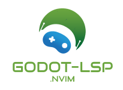

# Godot LSP Capabilities

Godot’s built-in Language Server Protocol (LSP) implementation for GDScript is functional but not on the same level as something like `clangd` or `pyright` due to the dynamic nature of GDScript and a partial implementation of the LSP specification. This document breaks down what’s possible, what’s not, and the reasons behind these limitations.

## ✅ What’s Possible with Godot’s LSP
Most core LSP features are supported because Godot’s GDScript language server runs directly inside the editor process (or in headless mode for external editors):

- **Diagnostics**
  - Syntax errors, parse errors, and some static type errors.
  - Warnings for unused variables, unreachable code, etc.
- **Go to Definition**
  - Works for variables, functions, classes, and signals within known scripts.
  - Can jump into built-in classes and engine source for some types.
- **Hover / Symbol Info**
  - Shows type hints, docstrings, and sometimes inferred types.
- **Autocomplete / IntelliSense**
  - Includes functions, members, signals, constants, and built-ins.
- **Signature Help**
  - Shows function parameters and default values.
- **Rename Symbol**
  - Works for local and project-wide symbols (though not 100% perfect with dynamic code).
- **Document Symbols / Outline View**
  - Lists functions, variables, signals, classes in the current file.
- **Workspace Symbols Search**
  - Find classes and members across the project.
- **Diagnostics on Save or Live**
  - Immediate feedback as you type.

## ❌ What’s (Currently) Not Possible or Incomplete
Some LSP capabilities are missing or not as strong as in other language servers:

- **Go to Type Definition**
  - Not implemented — you can go to the variable’s definition, but not directly to the class/type it refers to.
- **Full Type Inference Across All Dynamic Patterns**
  - If your code uses a lot of `load()` or dynamic property access, LSP may fail to guess types.
- **Find All References (Cross-File)**
  - Only partially works; it often misses dynamically referenced symbols.
- **Code Formatting**
  - No native formatter via LSP — use external tools like `gdformat`.
- **Code Actions / Quick Fixes**
  - Minimal support; mostly for adding missing imports or basic fixes.
- **Refactoring Tools Beyond Rename**
  - No extract method, move symbol, inline variable, etc.
- **Semantic Highlighting**
  - Basic highlighting; no advanced semantic tokenization like in C# or TypeScript.
- **Inlay Hints**
  - Parameter name hints, inferred type hints are not exposed via LSP yet.
- **Project-Wide Static Analysis Beyond Syntax/Types**
  - No lint rules for style, unused exports, complexity, etc., unless you add your own tooling.
- **Debug Integration via LSP**
  - Debugging is handled separately by Godot’s own debugger, not via LSP.

## Why Some Things Aren’t Possible
The main reasons:
1. **Dynamic Nature of GDScript** — Without running the code, some types or symbol references can’t be resolved.
2. **Partial LSP Feature Implementation** — Godot’s LSP covers common editor needs but not all optional LSP spec features.
3. **No External Type Indexer** — The LSP relies on Godot’s internal parser and symbol table, which doesn’t store all relationships needed (e.g., for “Go to Type Definition”).

## Godot LSP Feature Support Matrix
Based on the official LSP spec and Godot’s implementation, here’s a table marking each feature as ✅ supported, ⚠️ partial, or ❌ not supported, with notes.

| LSP Feature                | Status | Notes                                                                 |
|----------------------------|--------|----------------------------------------------------------------------|
| Hover                      | ✅      | Shows type hints, docstrings, constants, and inferred types where possible. |
| Completion                 | ✅      | Autocomplete for functions, members, constants, signals, keywords.    |
| Signature Help             | ✅      | Shows parameters and defaults when typing a call.                    |
| Go to Definition           | ✅      | Works for symbols with known locations, including built-ins.          |
| Go to Type Definition      | ❌      | Not implemented — can’t jump to a type/class from a variable.         |
| Go to Implementation       | ❌      | Not implemented — no way to jump to implementing scripts/interfaces.  |
| Find References            | ⚠️      | Works within same file; cross-file is unreliable and misses dynamic uses. |
| Document Symbols           | ✅      | Lists functions, variables, signals, classes for current file.        |
| Workspace Symbols          | ✅      | Search across project by name.                                       |
| Document Highlights        | ⚠️      | Highlights occurrences in file, but sometimes misses dynamic usages.  |
| Rename Symbol              | ⚠️      | Works for many cases, but can break in dynamic code or miss references. |
| Document Formatting        | ❌      | No formatter built into Godot LSP; use `gdformat` externally.         |
| Range Formatting           | ❌      | Same as above.                                                       |
| On-Type Formatting         | ❌      | Not implemented.                                                     |
| Code Actions / Quick Fixes | ⚠️      | Very limited — can sometimes add missing imports. No refactor suggestions. |
| Code Lens                  | ❌      | Not implemented.                                                     |
| Inlay Hints                | ❌      | Not exposed; Godot shows some hints in-editor, but not via LSP.       |
| Semantic Tokens            | ⚠️      | Basic tokenization; lacks advanced semantic highlighting.            |
| Diagnostics                | ✅      | Shows syntax errors, some type errors, warnings for unused variables. |
| Folding Ranges             | ✅      | Works for functions, classes, and some blocks.                       |
| Selection Ranges           | ⚠️      | Works for basic expressions and blocks, but not perfect.              |
| Linked Editing Ranges      | ❌      | Not implemented.                                                     |
| References to Built-in Docs| ✅      | Shows engine documentation in hover popups.                          |
| Debug Adapter Protocol     | ❌      | Debugging is handled separately by Godot, not via LSP.               |

### Biggest Missing Pieces for Godot LSP
- Go to Type Definition
- Code Formatting via LSP
- Refactoring Beyond Rename
- Robust Find-References Across Dynamic Code
- Inlay Hints / Advanced Semantic Tokens

## Where the “Godot LSP Spec” Comes From
1. **Godot’s Official Documentation**
   - Confirms LSP support for features like autocomplete, error highlighting, and go-to-definition. See [Godot Engine Docs](https://docs.godotengine.org/en/stable/tutorials/editor/external_editor.html).
2. **Godot’s Source Code**
   - The `modules/gdscript/language_server` directory defines handlers (e.g., `handle_completion`, `handle_definition`). Missing handlers (e.g., for `typeDefinition`) explain unsupported features.
3. **LSP Standard (Microsoft Spec)**
   - The [Language Server Protocol](https://microsoft.github.io/language-server-protocol/) spec lists all possible methods. Comparison reveals Godot’s gaps. See also [Wikipedia](https://en.wikipedia.org/wiki/Language_Server_Protocol).
4. **Empirical Testing**
   - Start Godot with `godot --editor --lsp --verbose` and monitor LSP messages to confirm supported methods.
